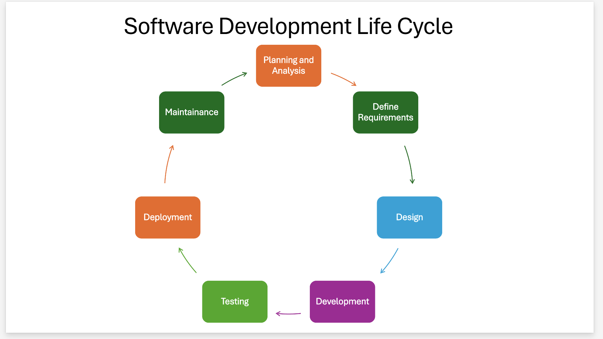

## Image Search Website with Sign up and Login Form

## Overview

The ImageSearch website is a dynamic platform that allows users to search for images using the Unsplash API. Additionally, users can personalize their experience by creating an account through the sign-up and login features. - The live link: [ImageSearch](https://imagesearchengn.netlify.app/index.html)

## Purpose

The purpose of this website is to provide users with a user-friendly and secure platform for searching images. It offers a personalized experience by enabling users to sign up and log in. Additionally, the website incorporates safeguards to prevent users from searching for inappropriate or sensitive words, such as violence and similar terms. Therefore, the ImageSearch platform is a safe and reliable environment suitable for both young and adult users to explore images securely.

## Table of Contents

1. [ImageSearch User Stories](#imageSearch-user-stories)
    - [User Story 1](#user-story-1)
    - [User Story 2](#user-story-2)
    - [User Story 3](#user-story-3)

2. [Features](#features)
3. [Technologies Used](#technologies-used)
4. [Setup and Installation](#setup-and-installation)
    - [Testing](#testing)
       - [Automated Testing](#automated-testing)
       - [Manual Testing](#manual-testing)
       - [Accessibility Testing](#accessibility-testing)
       - [Responsive Testing](#responsive-testing)
       - [Browser Testing](#browser-testing)
    - [Validation Testing](#validation-testing) 
       - [Signup Page Validation](#signup-page-validation) 
       - [Login Page Validation](#login-page-validation)
       - [ImageSearch Page Validation](#imageSearch-page-validation)
    - [Bugs](#bugs) 
    - [Future Improvment](#future-improvment)
    - [Deployment](#deployment)
       - [Version Control](#version-control)
       - [Deployment to Netlify](#deployment-to-netlify)
       - [Cloning of the Repository Code locally](#cloning-of-the-Repository-Code-locally)
5. [Wireframes](#Wireframes)
6. [Project Life Cycle](#project-life-cycle)
    - [Planning & Analysis](#planning-and-analysis)
    - [Define Requirements](#define-requirements)
    - [Design](#design)
    - [Development](#development)
    - [Testings](#testings)
    - [Deployment](#deployment)
    - [Maintenance](#maintenance)
7. [Credits](#credits)
8. [Content](#content)
9. [Author](#author)

# ImageSearch User Stories

## User Story 1

- **Feature Title:** Signup Page
- **User Story:** As a user, I want to sign up, so that I can have a personalized experience on the website.
- **Acceptance Criteria:**

  - The signup page displays the necessary form fields (name, email, password, and repeat password).
  - Each input field has client-side validation. (Example: Email format, password strength, matching passwords.)
  - The collected signup data is saved in a localStorage of the browser.
  - Error Handling: The page clearly displays appropriate error messages to the user if there's an issue with the form submission. (e.g., email already exists, invalid email format, password mismatch).
  - The signup page is responsive, displaying correctly on various device sizes.

- **Tasks:**

  - Create the signup page's HTML structure and style it using CSS. Ensure responsiveness for various screen sizes.
  - Implement JavaScript functions to validate the signup form data according to the acceptance criteria (email format, password length, matching passwords).
  - Check if the submitted email already exists in the localStorage of the browser.
  - Use appropriate data structures (objects) to store user data within localStorage of the browser.

  

## User Story 2

- **Feature Title:** Login Page
- **User Story:** As a user, I want to login, so that I can have a personalized experience on the website.
- **Acceptance Criteria:**

  - The login page displays the necessary form fields ( email, password).
  - Each input field has client-side validation. (Example: Email format, password strength, matching password and email with existing users.)
  - The collected signup data is saved in a local localStorage of the browser.
  - Error Handling: The page clearly displays appropriate error messages to the user if there's an issue with the form submission. (e.g., email does not exists, invalid email format, password mismatch).
  - The login page is responsive, displaying correctly on various device sizes.

- **Tasks:**

  - Create the login page's HTML structure and style it using CSS. Ensure responsiveness for various screen sizes.
  - Implement JavaScript functions to validate the login form data according to the acceptance criteria (email format, password length , matching passwords).
  - Check if the submitted email does not exist in the localStorage of the browser.
  - Use appropriate data structures (objects) to store user data within localStorage of the browser.

    

## User Story 3

- **Feature Title:** Image Search Page
- **User Story:** As a user, I want to search for images by entering an image name into a search input text box so that I can view search results on the same page. Additionally, I would like to enjoy a personalized experience when I sign in and sign out.
- **Acceptance Criteria:**

  - The Image Search page must include the necessary components of a navigation bar, which features:
    - A logo.
    - A welcome message displayed when the user is signed in.
    - A sign-out button when the welcome message is present.
    - Sign-in and sign-up buttons when the welcome message is not displayed.
  - The search area of the page should include all essential form components:
    - A text box for entering image search queries.
    - A button to initiate the image search.
  - The entered search data should be submitted to the image API via an HTTP POST request to retrieve results.
  - The search results must be displayed on the Image Search page.
  - A "Load More" button should be available at the bottom of the Image Search page to fetch additional results.
  - Prevent users from searching for disallowed words like "kill" and etc.

- **Tasks:**

  - Create the HTML structure for the index.html (Image Search) page and apply CSS for styling, ensuring responsiveness across various screen sizes.
  - Implement JavaScript functions to retrieve the result of image search input data in accordance with the acceptance criteria.
  - Present the image search results on the index.html page (Image Search page) along with a "Load More" button.
  - Ensure that clicking the "Load More" button on the index.html page fetches additional image search results.
  - Verify if the user is signed in to display the welcome message and remove it when the user signs out.
  - Verify whether users are searching for disallowed words such as "kill" and others; if so, display "Invalid input."

    

## Features

1. **Signup Function:** Users can create an account by entering their email, name, password, and confirming their password. The system validates that the email has the correct syntax and does not already exist in localStorage. It also ensures that the name is at least two characters long, and that both the password and confirmation match, with a minimum length of eight characters. If all validation criteria are met, the user's data is securely saved in the browser's localStorage, and the user is redirected to the ImageSearch page, where a personalized welcome message displaying their name appears in the header.
2. **Signin Function:** Users can log in by entering their email and password. The system verifies that the entered credentials match existing data stored in localStorage. If the credentials are correct, the user is redirected to the ImageSearch page, where a personalized welcome message displaying their name appears in the header.
3. **Search Image Function:** Search Image Function: Users can search for images by entering keywords into the search box and clicking the search button. The system retrieves relevant images from the Unsplash API and displays the results on the webpage. Additionally, the input is validated to ensure that it is not empty, does not consist solely of spaces, and does not contain any unaccepted or inappropriate words.
4. **Responsive Design:** Adapts seamlessly to various screen sizes and devices for an optimal user experience.

## Technologies Used

- **HTML5**: For structuring the webpage content.
- **CSS3**: For styling and enhancing the visual appeal.
- **https://boxicons.com/**: For high quality web icons.
- **JavaScript**: Used to validate user-entered data, ensuring it meets the required criteria for correctness and completeness.
- **Browser LocalSrorage**: Used to store registered user data during sign-up and to authenticate users during login by matching entered credentials with existing data stored in localStorage.
- **Unsplash API**: Fetches images based on the keywords entered by the user, providing relevant search results.

# Setup and Installation

## Testing

### Automated Testing:

A testing approach that uses software tools and scripts to automatically execute test cases, ensuring consistency, efficiency, and repeatability.

### Manual Testing:

A testing approach where testers manually execute test cases without automation, relying on human judgment to evaluate functionality, usability, and user experience.

Summary:

- Automated testing is best suited for repetitive, high-volume, and regression scenarios where speed and accuracy are crucial.
- Manual testing is essential for usability, exploratory, and subjective assessments that require human insight.

Both approaches complement each other and are often used together in a comprehensive testing strategy.

### Accessibility Testing

  - I ran the pages through Lighthouse and confirmed that the colors and fonts are easy to read and that the site is accessible.

  

  

  

### Responsive Testing

<table>
    <thead>
      <tr>
        <th>Tested Item</th>
        <th>Max-Width 320px Result (Small Mobile)</th>
        <th>Min-Width 425px Result (Large Mobile)</th>
        <th>Min-Width 768px Result (Tablet)</th>
        <th>Min-Width 992px and Larger Result (Desktop)</th>
     </tr>
    </thead>
    <tbody>
      <tr>
        <td>Buttons, images and Links</td>
        <td>All website's buttons, images and links are placed as intended (Tested).</td>
        <td>All website's buttons, images and links are placed as intended (Tested).</td>
        <td>All website's buttons, images and links are placed as intended (Tested).</td>
        <td>All website's buttons, images and links are placed as intended (Tested).</td>
      </tr>
    </tbody>
</table>
   
### Browser Testing
I tested a range of web browswers. See an example of tests below.
<table>
  <thead>
    <tr>
      <th>Browser</th>
      <th>Appearance</th>
      <th>Responsiveness</th>
    </tr>
  </thead>
  <tbody>
    <tr>
      <td>Chrome</td>
      <td>All the page's secttions format correctly. All buttons work well.</td>
      <td>Responsive design / Very good</td>
    </tr>
    <tr>
      <td>Edge</td>
      <td>All the page's secttions format correctly. All buttons work well.</td>
      <td>Responsive design / Very good</td>
    </tr>
 
  </tbody>
</table>

- HTML - No errors found when running the code through the [W3C HTML Validator](https://validator.w3.org/)
  
  
  

- CSS - No errors found when running the code through the [W3C CSS Validator](https://jigsaw.w3.org/css-validator/)
  

- JavaScript - No errors found when running the code through the [jshint](https://jshint.com/)
  
  

  ## Validation Testing

### Signup Page Validation

I tested various input scenarios on the Signup page to ensure that invalid data is correctly rejected and valid data is accepted and stored in localStorage. Below are some examples of the test cases conducted.

<table>
  <thead>
    <tr>
      <th>Input TextBox Name</th>
      <th>Data Entered</th>
      <th>Result</th>
    </tr>
  </thead>
  <tbody>
    <tr>
      <td>First Name</td>
      <td>a</td>
      <td>Firstname has to be more than 2 letters</td>
    </tr>
    <tr>
      <td>Email</td>
      <td>hello@gmail</td>
      <td>Email syntax is not valid</td>
    </tr>
    <tr>
      <td>Password</td>
      <td>1234</td>
      <td>Password must be 8 characters or longer</td>
    </tr>
     <tr>
      <td>Repeated Password</td>
      <td>123</td>
      <td>Repeat Password isn't matching Password or isn't 8 characters or longer</td>
    </tr>
  </tbody>
</table>

When a user successfully signs up with valid data, they will be redirected to the ImageSearch page, where a personalized welcome message will be displayed at the top of the page.

### Login Page Validation

I tested various input scenarios on the Login page to ensure that invalid data is correctly rejected and valid data is accepted and match the user data which stored in localStorage. Below are some examples of the test cases conducted.

<table>
  <thead>
    <tr>
      <th>Input TextBox Name</th>
      <th>Data Entered</th>
      <th>Result</th>
    </tr>
  </thead>
  <tbody>
    <tr>
      <td>Email</td>
      <td>hello@gmail</td>
      <td>Email syntax is not valid. Email is not exist</td>
    </tr>
    <tr>
      <td>Password</td>
      <td>1234</td>
      <td>Password must be 8 characters or longer. Password is wrong</td>
    </tr>
  </tbody>
</table>

When a user successfully log in with valid data, they will be redirected to the ImageSearch page, where a personalized welcome message will be displayed at the top of the page.

### ImageSearch Page Validation

I tested various input scenarios on the ImageSearch page image search box to ensure that invalid data is correctly rejected and valid data is accepted. Below are some examples of the test cases conducted.

<table>
  <thead>
    <tr>
      <th>Input TextBox Name</th>
      <th>Data Entered</th>
      <th>Result</th>
    </tr>
  </thead>
  <tbody>
   <tr>
      <td>Search for Images</td>
      <td>  (spaces or no text)</td>
      <td>Invalid Input </td>
    </tr>
    <tr>
      <td>Search for Images</td>
      <td>death</td>
      <td>Invalid Input (because is one of unaccepted word in unAcceptedWord array in userdata.js file)</td>
    </tr>
    <tr>
      <td>Search for Images</td>
      <td>&</td>
      <td>Invalid Input</td>
    </tr>
    <tr>
      <td>Search for Images</td>
      <td>death in world</td>
      <td>Invalid Input</td>
    </tr>
    <tr>
      <td>Search for Images</td>
      <td>fhgfjfjfjjfhjfjhjfjhj</td>
      <td>Invalid Input</td>
    </tr>
  </tbody>
</table>

When a user enters valid search keywords, the system retrieves relevant images from the Unsplash API and displays the results on the webpage.

## Bugs

- (Failed to load resource: the server responded with a status of 400 ()) when the user entered wrong data.

- The Bug after handling it by adding if **`if(response.ok)`**, if (results && **`results.length > 0`**) and **else {console.error("Error response:", response.status, response.statusText);**
  **noSearchResult();}** else statements in userdata.js

          async function searchImages() {
          keyWord = inputImage.value;
          const url = `https://api.unsplash.com/search/photos?page=${page}&query=${keyWord}&client_id=${apiKey}`;
          try {
          const response = await fetch(url);
          **`if(response.ok)`** {
             const data = await response.json();
             const results = data.results;
             if (results && **`results.length > 0`**) {
             if (page === 1) {
              imgWrapper.innerHTML = "";
            }

          results.map((result) => {
            const imgDiv = document.createElement("div");
            imgDiv.classList.add("result-image");
            const img = document.createElement("img");
            img.src = result.urls.small;
            img.alt = result.alt_description;
            const imgLink = document.createElement("a");
            imgLink.href = result.links.html;
            imgLink.target = "_blank";
            imgLink.textContent = result.alt_description;
            imgDiv.appendChild(img);
            imgDiv.appendChild(imgLink);
            imgWrapper.appendChild(imgDiv);
          });

          page++;
          if (page > 1) {
            loadButton.style.display = "block";
          }
        } else {
          noSearchResult();
        }
      } **else {console.error("Error response:", response.status, response.statusText);**
        **noSearchResult();}**

  } catch (err) {
  noSearchResult();
  }
  }

## Future Improvment

- Implement automated testing using Jest to ensure code reliability and facilitate easier maintenance.

## Deployment

### Version Control

- The site was created using Visual Studio Code and pushed to Github to the remote repository.
- Git commands were used throughout the development to push the code to the remote repository. The following git commands were used:
  - git add . - to add the files to the staging area before being committed.
  - git commit -m "commit message" - to commit changes to the local repository queue that are ready for the final step.
  - git push - to push all committed code to the remote repository on Github.

### Deployment to Netlify

- The site was deployed to https://app.netlify.com/:
  - In the main page click on Add new site drop down list ,and choose Import an existing project
  - Choose github, then choose the project repository
  - Give the site name,and choose main for branch to deploy
  - Click Deploy button and wait until the deployment process finish
- The live link: [ImageSearch](https://imagesearchengn.netlify.app/index.html)

### Cloning of the Repository Code locally

- Go to the Github repository that you want to clone
- Click on the Code button located above all the project files
- Click on HTTPS and copy the repository link
- Open the IDE of your choice and and paste the copied git url into the IDE terminal
- The project is now created as a local clone

# Wireframes

- The initial design and layout of the ImageSerach, Signup, Signin webpages were planned using the marvelapp designing tool.

- Desktop, Tablet, and Mobile Page Wireframe

# Project Life Cycle

## Planning and Analysis

I have decided to develop an ImageSearch website featuring signup and signin functionalities, enabling users to securely search images while enjoying a personalized experience. Additionally, this project provides an opportunity to practice validating user input data and effectively integrating external APIs.

## Define Requirements

This phase transforms the outcomes of the planning and analysis phase into clear, actionable requirements by developing user stories. During this phase, I divided the project into three modules: ImageSearch, SignIn, and SignUp. I also defined the user stories for each module to clarify their functionalities and user interactions.

## Design

The design phase translates the requirements gathered earlier into detailed wireframes and visual layouts. During this stage, I developed the HTML and CSS for each module (ImageSearch, SignIn, and SignUp), establishing the structure and visual style to ensure a cohesive user experience.

## Development

Create a repository on GitHub and clone it locally to start developing each module independently. Use JavaScript to implement validation functions and enable interaction with the Unsplash API. After completing the individual modules (ImageSearch, SignIn, and SignUp), integrate them into a cohesive application. Ensure smooth navigation between modules and verify that user interactions are handled correctly—for example, when a user signs in, they should be redirected to the ImageSearch page with a personalized welcome message displaying their name.

## Testings

Conduct tests for HTML, CSS, and JavaScript to identify bugs, assess performance, ensure accessibility, check responsiveness, validate user inputs, and verify alignment with user expectations.

## Deployment

Deploy the website using GitHub and Netlify, then test it again as a live site.

## Maintenance

Fix any bugs and errors that were missed in the earlier testing phase. Additionally, create a README file for the website repository to provide documentation.

# Credits

- Special thanks to my mentor, Spencer_ci, and my Lecturer Robert Thompson from Dudley College for their invaluable support and for answering all my questions on Slack and Teams!
- I used [DeepAI](https://deepai.org/) to receive suggestions for handling bugs in the code..

# Content

- The icons in Signup and Login pages from [Boxicons](https://boxicons.com/).
- The images in ImageSearch from [Unsplash](https://unsplash.com/).
- The tab icon is sourced from [favicon.io](https://favicon.io/)
- The Email regex from [tecadmin](https://tecadmin.net/validate-email-address-in-javascript/)
- The project inspired from this [YouTube tutorial](https://www.youtube.com/watch?v=E4znbZgUWzA).

# Author

Manal Abdulqawi
